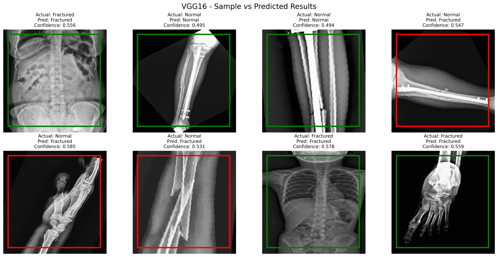

## X-Ray Imaging Dataset for the Detection of Bone Integrity Fractured vs. Non-Fractured


# Install

```zsh
python3 -m venv .venv
source .venv/bin/activate
pip install -r requirements.txt
python -m quick_cnn # to check does the code works? test 1% data,1 epoch
python -m full_cnn # to run model properly whole dataset
```


## Output
sample_vs_predicted sampling


