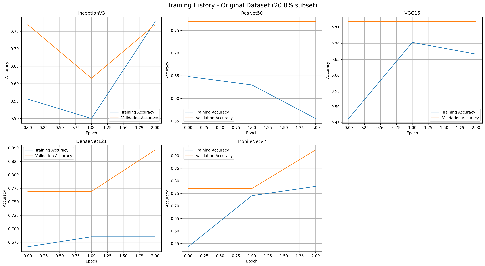

## X-Ray Imaging Dataset for the Detection of Bone Integrity Fractured vs. Non-Fractured


# Install

```zsh
python3 -m venv ~/venv
source ~/venv/bin/activate
pip install -r requirements.txt
python -m quick_cnn # to check does the code works?
python -m full_cnn # to run model properly
```


## Output



# Description
This dataset comprises 9,000 images, evenly categorized into 2 distinct classes. It was developed for a computer vision thesis undertaken by postrgraduate students in Department of  Computer Science and Engineering. Netrokona University, Netrokona, Bangladesh. The collection features both original and augmented images, all uniformly resized to 512x512 pixels using high-quality LANCZOS interpolation to maintain visual clarity.

## Folder Structure
The dataset is organized into the following class folders:

-Fractured  
-Non-Fractured


Each folder contains:
- Original images (named like Healthy_0001.JPG)
- Augmented images (named like Healthy _001.jpg)

## Data Augmentation Techniques
To increase variability and robustness for machine learning models, the following augmentations were applied:
- Random Horizontal Flip
- Rotation up to ±20 degrees
- Color Jitter (brightness, contrast, saturation, hue)
- Random Resized Crop to 512x512

These transformations were applied using PyTorch's torchvision library.

## Image Format
- Format: JPG
- Size: 512x512 pixels
- Color Mode: RGB

## Use Case
This dataset is suitable for:
- Image classification tasks
- Transfer learning model fine-tuning
- Federated Learning
- Dataset augmentation research
- Student or academic thesis

## Authors

**Farhan Masud Nayem**  
Department of Computer Science and Engineering  
Netrokona University  
📧 farhan.masud.mn@gmail.com  
📱 01761826010  

**Co-authors:**

**Farida Siddiqi Prity**  
Department of Computer Science and Engineering  
Netrokona University  
📧 prity@neu.ac.bd  
📱 01877557081 

**Md. Maruful Islam Rafe**  
Department of Computer Science and Engineering  
Netrokona University  
📧 maruful.rafe.mr@gmail.com  
📱 01918927246 

**Arifur Rahman Arif** 
Department of Electrical and Electronic Engineering
Faridpur Engineering College
📧 mdarifurrahmanj@gmail.com
📱 01772441559 


## License
This dataset is shared under the **Creative Commons Attribution 4.0 International (CC BY 4.0)** license. You are free to use, share, and adapt the dataset with proper attribution.

## Citation
If you use this dataset in your research or projects, please cite:
DOI: 10.17632/w8sw34p752.1

Thank you for using this dataset!
# From your project root
cd "/Users/samayun/Downloads/X-ray Imaging Dataset for Detecting Fractured vs. Non-Fractured Bones"

python3 -m venv .venv
source .venv/bin/activate

python -m pip install --upgrade pip
python -m pip install -r requirements.txt

```

## Train pretrained CNN models (transfer learning)

The script `cnn.py` trains multiple torchvision models (ResNet50, DenseNet121, EfficientNet-B0, MobileNetV3-Large, InceptionV3, VGG16) with transfer learning, evaluates on a held-out test split, and writes model checkpoints and JSON reports.

```zsh
cd "/Users/samayun/Downloads/X-ray Imaging Dataset for Detecting Fractured vs. Non-Fractured Bones"

# Basic run (CPU/MPS). Defaults: data at "Augmented Dataset", outputs to ./outputs
python cnn.py --models resnet50,densenet121,efficientnet_b0,mobilenet_v3_large,inception_v3,vgg16 --epochs 8 --batch-size 32

# If you have a CUDA GPU and want mixed precision
python cnn.py --models resnet50,densenet121,efficientnet_b0,mobilenet_v3_large,inception_v3,vgg16 --epochs 10 --batch-size 32 --device cuda --fp16

# Change dataset or output locations if needed
python cnn.py --data-dir "/absolute/path/to/your/dataset_root" --output-dir "/absolute/path/to/outputs" --models resnet50,efficientnet_b0 --epochs 5
```

### Notes
- Dataset root should contain class subfolders `Fractured/` and `Non-Fractured/` (as in the provided `Augmented Dataset/`).
- By default, the script uses random splits: 70% train, 15% val, 15% test. Configure with `--val-split` and `--test-split`.
- Use `--feature-extract` to freeze the backbone (train classifier only). Otherwise, the script fine-tunes with a differential LR and, as a bonus, unfreezes the last blocks for EfficientNet-B0.
- Artifacts are saved under `outputs/`:
  - `outputs/models/<model>_best_<timestamp>.pt` (best validation checkpoint)
  - `outputs/reports/<model>_<timestamp>.json` (history and test metrics)
  - `outputs/summary.json` (short summary across models)


cd "/Users/samayun/Downloads/X-ray Imaging Dataset for Detecting Fractured vs. Non-Fractured Bones"

python3 -m venv .venv && source .venv/bin/activate
python -m pip install --upgrade pip
python -m pip install torch torchvision scikit-learn

# Train 6 models (TensorFlow/Keras)
python cnn.py --models resnet50,densenet121,efficientnet_b0,mobilenet_v3_large,inception_v3,vgg16 --epochs 8 --batch-size 32 --feature-extract

```

### Apple Silicon (M1/M2/M3) notes

- This project now uses TensorFlow/Keras with `tensorflow-macos` and `tensorflow-metal` for GPU acceleration on Apple Silicon.
- If you previously installed PyTorch, it's not required anymore for `cnn.py`.
- Default dataset path remains `Augmented Dataset/`.

cd "/Users/samayun/Downloads/X-ray Imaging Dataset for Detecting Fractured vs. Non-Fractured Bones"
python3 -m venv .venv && source .venv/bin/activate
python -m pip install --upgrade pip
python -m cnn