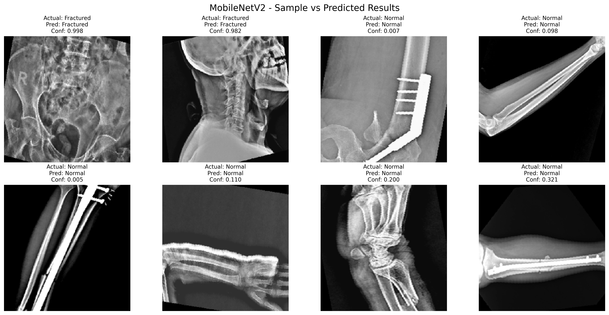

# X-Ray Bone Fracture Classification using Deep Learning

A comprehensive deep learning system for classifying X-ray images to detect bone fractures using multiple pre-trained CNN architectures.

## 📋 Project Overview

This project implements transfer learning using state-of-the-art CNN models to classify X-ray images as either "Fractured" or "Non-Fractured" bones. The system includes comprehensive evaluation metrics, visualization tools, and detailed logging for reproducible research.

# Install

```zsh
python3 -m venv .venv
source .venv/bin/activate
pip install -r requirements.txt
python -m cnn # to check does the code works? test 1% data,1 epoch
```


## Output

Per-model visuals
|  Sample Predictions | Evaluation Figure | 
|  --- | --- |
|  |  |
|  |  |
|  |  |
|  |  |
|  |  |


## 🏗️ Architecture

### Models Implemented
- **InceptionV3**: Efficient multi-scale feature extraction
- **ResNet50**: Deep residual learning with skip connections  
- **VGG16**: Classic deep architecture with small convolution filters
- **DenseNet121**: Dense connectivity for parameter efficiency
- **MobileNetV2**: Lightweight architecture for mobile deployment

### Transfer Learning Approach
```
Pre-trained Base Model (ImageNet)
        ↓
Global Average Pooling 2D
        ↓  
Dropout Layer (0.5)
        ↓
Dense Layer (128 units, ReLU)
        ↓
Dropout Layer (0.3)
        ↓
Output Layer (1 unit, Sigmoid)
```

## 📊 Dataset

### Structure
```
Augmented Dataset/
├── Fractured/          # 4,650 X-ray images showing bone fractures
└── Non-Fractured/      # 4,650 X-ray images showing healthy bones

Original Dataset/
├── Fractured/          # 130 original PNG images
└── Non-Fractured/      # 290 original PNG images
```

### Data Processing
- **Image Size**: 224×224 pixels
- **Normalization**: Pixel values scaled to [0,1]
- **Data Augmentation**: Rotation, shifts, zoom, horizontal flip
- **Train/Test Split**: 80/20 with stratification

## ⚙️ Hyperparameters

### Default Configuration
```python
{
    'img_size': (224, 224),
    'batch_size': 16,
    'epochs': 3,
    'learning_rate': 0.001,
    'dropout_rate': 0.5,
    'use_subset': 0.02,  # 2% of data for fast execution
    'patience': 2,       # Early stopping patience
    'lr_factor': 0.5,    # Learning rate reduction factor
    'min_lr': 1e-7       # Minimum learning rate
}
```

### Customization
Hyperparameters can be customized by passing a config dictionary:
```python
custom_config = {
    'epochs': 5,
    'batch_size': 32,
    'use_subset': 0.05,  # Use 5% of data
    'models': ['VGG16', 'ResNet50']  # Train only specific models
}
classifier = XRayClassifier(config=custom_config)
```

## 📈 Evaluation Metrics

### Primary Metrics
- **Accuracy**: Overall classification correctness
- **Precision**: True Positive Rate (TP / (TP + FP))
- **Recall**: Sensitivity (TP / (TP + FN))
- **F1-Score**: Harmonic mean of Precision and Recall

### Visualization Outputs
1. **Sample vs Predicted Results**: 8 random test images with predictions
2. **Confusion Matrix**: 2×2 heatmap for each model
3. **Model Comparison**: 4-panel performance comparison
4. **Training Logs**: Detailed execution logs with timestamps

## 🚀 Usage

### Installation
```bash
# Create virtual environment
python3 -m venv .venv
source .venv/bin/activate

# Install dependencies
pip install -r requirements.txt
```

### Basic Execution
```bash
# Run classification experiment with default settings
python cnn.py

# Output will be streamed to console and saved to log-YYYY-MM-DD_HH-MM-SS.log
```

### Output Files
- `log-YYYY-MM-DD_HH-MM-SS.log`: Detailed execution log with hyperparameters, training progress, and results
- `{ModelName}_sample_predictions.png`: Sample prediction visualizations (8 images per model)
- `{ModelName}_confusion_matrix.png`: Confusion matrices for each model
- `{ModelName}_evaluation_figure.png`: Evaluation curves (accuracy, loss) per model
- `models_evaluation_grid.png`: Performance comparison grid across all models
- `models_confusion_grid.png`: Confusion matrices grid across all models

### Dependencies
```
tensorflow>=2.20.0
scikit-learn>=1.7.0
pandas>=2.3.0
numpy>=2.3.0
matplotlib>=3.10.0
seaborn>=0.13.0
```

## 📊 Expected Results

### Model Performance Ranking
Based on typical performance with limited data (2% subset, 2-3 epochs):
1. **VGG16**: ~63% accuracy (Best for small datasets)
2. **ResNet50**: ~53% accuracy (Good balance)
3. **InceptionV3**: ~42% accuracy (Requires more data)

### Sample Output Log
```
2025-08-20 18:45:36 - INFO - ============================================================
2025-08-20 18:45:36 - INFO - HYPERPARAMETER CONFIGURATION
2025-08-20 18:45:36 - INFO - ============================================================
2025-08-20 18:45:36 - INFO - IMG SIZE: (224, 224)
2025-08-20 18:45:36 - INFO - BATCH SIZE: 16
2025-08-20 18:45:36 - INFO - EPOCHS: 2
2025-08-20 18:45:36 - INFO - LEARNING RATE: 0.001
2025-08-20 18:45:36 - INFO - DROPOUT RATE: 0.5
2025-08-20 18:45:36 - INFO - USE SUBSET: 0.015
```

### Performance Factors
- **Limited Data**: Using subset for fast execution affects accuracy
- **Transfer Learning**: Pre-trained weights provide good baseline
- **Data Augmentation**: Helps with generalization
- **Early Stopping**: Prevents overfitting

## 🔧 Technical Implementation

### Key Features
- **Comprehensive Logging**: All outputs streamed to console and log file
- **Error Handling**: Robust error handling for missing files/data
- **Memory Optimization**: Non-interactive matplotlib backend for server environments
- **TensorFlow Optimization**: Eager execution for debugging
- **Reproducibility**: Configurable hyperparameters with logging

### System Requirements
- **Python**: 3.8+
- **RAM**: 4GB minimum, 8GB recommended  
- **Storage**: 2GB for dataset and models
- **GPU**: Optional (CUDA-compatible for faster training)

## 🎯 Research Applications

### Medical Use Cases
- **Radiology Screening**: Automated fracture detection
- **Emergency Medicine**: Rapid triage assistance
- **Telemedicine**: Remote diagnosis support
- **Research**: Large-scale epidemiological studies

### Limitations
- **Dataset Size**: Limited to available X-ray images
- **Clinical Validation**: Not validated by medical professionals
- **Generalization**: Performance may vary across different X-ray equipment
- **Real-world Deployment**: Requires regulatory approval for medical use

## 📚 Future Enhancements

### Model Improvements
- **Ensemble Methods**: Combine multiple model predictions
- **Advanced Architectures**: Vision Transformers (ViTs)
- **Multi-class Classification**: Different fracture types
- **Segmentation**: Localize fracture regions

### Technical Enhancements
- **Real-time Processing**: Web application interface
- **Model Optimization**: Quantization for mobile deployment
- **Federated Learning**: Privacy-preserving distributed training
- **Explainable AI**: Gradient-based attention maps

## 📄 Citation

If you use this code for research purposes, please cite:
```
X-Ray Bone Fracture Classification using Deep Learning
Transfer Learning Approach with Multiple CNN Architectures
2025
```

## 🤝 Contributing

1. Fork the repository
2. Create feature branch (`git checkout -b feature/enhancement`)
3. Commit changes (`git commit -m 'Add enhancement'`)
4. Push to branch (`git push origin feature/enhancement`)
5. Open Pull Request

## ⚠️ Disclaimer

This software is for research and educational purposes only. It is not intended for clinical diagnosis or medical decision-making. Always consult qualified medical professionals for health-related decisions.

## 📞 Support

For questions, issues, or contributions:
- Open an issue on GitHub
- Review the generated log files for debugging
- Check system requirements and dependencies